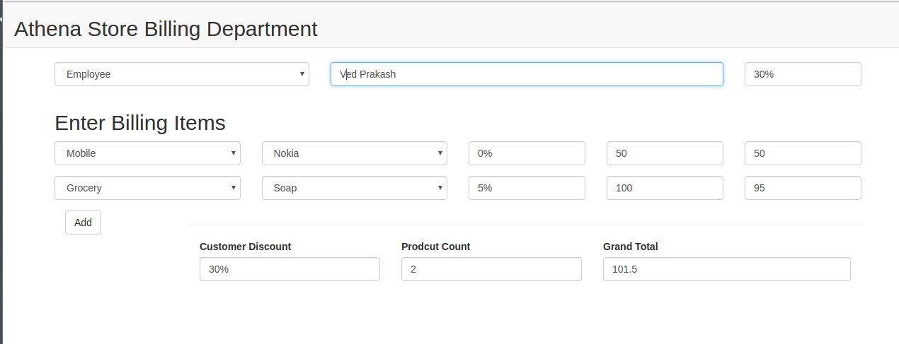

# Billing App with React ES6 Webpack

This is what a running this example looks like:


Project with the following technologies:
* [React](https://github.com/facebook/react)
* [Babel 6](http://babeljs.io)
* [Webpack](http://webpack.github.io) for bundling
* [Webpack Dev Server](http://webpack.github.io/docs/webpack-dev-server.html)
* [React Transform](https://github.com/gaearon/react-transform-hmr) for hot reloading React components in real time.


## Running

You must have [npm](https://www.npmjs.org/) installed on your computer.
From the root project directory run these commands from the command line:

```
npm install
npm start
Open http://localhost:5000


## Credit

This React/flux application was created by [Ved Prakash](https://www.linkedin.com/in/ved-prakash-3766268a)(http://stackoverflow.com/users/3265777/ved).  This README document was written by Me.

## License
NO License.
```


